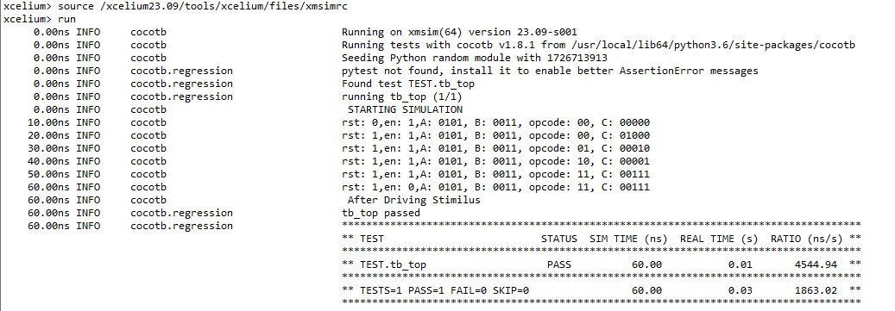

# Sequential ALU verification using cocotb
## Table of contents
- [Design RTL](#design-rtl)
- [Makefile](#makefile)
- [libraries Import](#libraries-import)
- [Clock Generation and Design Instantiation](#clock-generation-and-design-instantiation)
- [Driving Stimulus](#driving-stimulus)
- [Output Log](#output-log)
## Design RTL
The design is a simple Sequential ALU that do operations on input according to the opcode

| opcode          | Description  |
|-----------------|--------------|
| 2'b00    |     ADD     |
| 2'b01   | SUB         |       
| 2'b10       | AND    | 
| 2'b11       | OR    |     

``` sv
module SEQ_ALU ( input clk,rst,en,
                 input signed [3:0] A,B,
		 input [1:0] opcode,
                 output reg signed [4:0] C );
always@(posedge clk, negedge rst)
 begin
  if(!rst)
   begin
    C<=0;
   end
  else if(en)
   begin
    case(opcode)
     2'b00:
       begin
      	C<=A+B;
       end
     2'b01:
       begin
      	C<=A-B;     
       end
     2'b10:
       begin
      	C<=A&B;      
       end
     2'b11:
       begin
      	C<=A|B;      
       end
     default:
       begin
      	C<=0;      
       end
    endcase
   end
 end 
endmodule
```
## Makefile
To enable the compiler to run the design and test files, A make file is made.
``` mak
TOPLEVEL_LANG ?= verilog
SIM ?=xcelium 
PWD=$(shell pwd)

ifeq ($(TOPLEVEL_LANG),verilog)
VERILOG_SOURCES = $(PWD)/design.sv
else ifeq ($(TOPLEVEL_LANG),vhdl)
  VHDL_SOURCES = $(PWD)/design.vhdl
else
	$(error A valid value (verilog or vhdl) was not provided for TOPLEVEL_LANG=$(TOPLEVEL_LANG))
endif
TOPLEVEL := SEQ_ALU #Module_NAME
MODULE:= TEST             #File_Python_Name
include $(shell cocotb-config --makefiles)/Makefile.sim
```
## libraries Import
To use the functions of the cocotb in python, some libraries need to be imported.
``` python
import cocotb
from cocotb.clock import Clock
from cocotb.triggers import *
from cocotb.handle import Force, Release, Freeze, Deposit
```
## Clock Generation and Design Instantiation
``` python
@cocotb.test()
async def tb_top(dut):
    cocotb.log.info(" STARTING SIMULATION ")
    CLK = Clock(dut.clk, 10, units="ns")
    dut.rst.value = 0 
    await cocotb.start(CLK.start())
    await cocotb.start_soon(driving_stimilus(dut))
    cocotb.log.info(" After Driving Stimilus")
```
## Driving Stimulus
``` python
async def driving_stimilus(dut):
    for i in range(6):
        await FallingEdge(dut.clk)
        dut.rst.value= 0 if(i==0) else 1
        dut.en.value= 1 if(i!=5) else 0
        dut.A.value= 5 
        dut.B.value= 3
        dut.opcode.value = 0 if i == 0 else (i - 1 if i != 5 else 3)
        await RisingEdge(dut.clk)
        await ReadOnly()
        cocotb.log.info(f"rst: {dut.rst.value},en: {dut.en.value},A: {dut.A.value}, B: {dut.B.value}, opcode: {dut.opcode.value}, C: {dut.C.value}")
```
**This stimulus runs 5 different tests for A=5 and B = 3**
## Output Log

